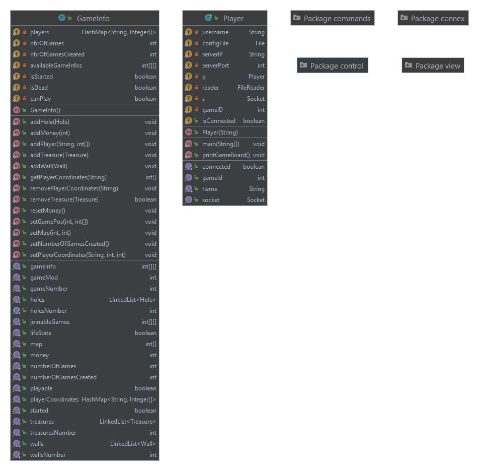

# PI4 - Chasse au trésor

**Ce dépôt Gitlab est dédié au développement du projet de programmation du semestre 4 (PI4).**

## Présentation

L'objectif de ce projet était de réaliser un logiciel composé de deux parties permettant de jouer à un jeu de chasse au trésor en réseau. Les deux parties du logiciel sont les suivantes: 
*  Une partie serveur chargée de gérer les connexions des clients, de générer les cartes et partie de jeu.
*  Une partie client pouvant se connecter au serveur afin de participer à la chasse au trésor.

Ce projet a été réalisé entièrement en JAVA avec Gradle comme outil de développement.

## Principe : 
La chasse au trésor est modélisée par un plateau de jeu rectangulaire composé de cases sur lesquelles sont placées trois types de tuiles. Les différents types de tuiles sont les suivants:
*  Les murs: le joueur ne peut pas marcher sur ces tuiles. Elles ont pour but de définir le labyrinthe dans lequel évoluent les joueurs.
*  Les trous: le joueur meurt lorsqu'il marche sur ces tuiles.
*  Les trésors: le joueur récupère la valeur du trésor en marchant dessus, ce après quoi le trésor disparaît.

Chaque case peut également être vide pour permettre au joueur d'évoluer sur la carte.

Les joueurs ne peuvent se déplacer que verticalement ou horizontalement.

La partie se termine lorsque tous les trésors ont été récupérés ou lorsque tous les joueurs sont morts.


## Modes de jeu :

Le serveur propose de créer des parties avec des modes de jeu différents:
*  Le mode **Speeding-Contest**: chaque joueur se déplace quand il veut, il suffit d'être le plus rapide pour gagner
*  Le mode **Tour-par-tour**: Les joueurs jouent chacun leur tour et un joueur ne peut se déplacer que lors de son tour.

## Interface graphique :

Le projet possède une interface graphique permettant de visualiser et de se repérer sur la carte le plus agréablement possible (voir plus haut), il possède également une interface permettant de contrôler les déplacements du personnage (voir plus haut) et une interface permettant de lister les parties existantes sur le serveur, les rejoindre ou bien en créer une toute nouvelle (voir ci-dessous).


## Répartition des taches :

**Matthieu Le Franc :**
* Implémentation des commandes de communication **Server/Client** avec l'aide de ``Hugo Jacotot`` et leur traitement
  * Système d'échange de messages **client -> server** & **server -> client**. Fait avec ``Hugo Jacotot``.
    * ``Voir issues :`` #13 | #32
  * Récupération des informations du **serveur** vers le **client** (liste des parties, spécificités, nombre de trésors, etc.).
    * ``Voir issues :`` #35 | #56 | #43 | #48 | #57
  * Récupération des coordonnées de chaque élément (trésors, trous...) afin de les stocker de manière ordonnées et traitables du côté client (merci à ``Hugo`` pour le coup de main).
    * ``Voir issues :`` #47
* stockage des informations de jeu chez le client class **GameInfo**
  * ``voir issues :`` #39
* **Gestion d'une partie :**
  * Système d'arbitrage permettant au client de jouer tant que le joueur est vivant, gestion des **game over** et de qui remporte la partie. **Voir issues :** #52 | #53 | #55 
  * Système de tout par tour pour le mode de jeu **Speeding contest** attribuant le droit de jouer aux membre d'une partie un par un. 
    * ``Voir issues :`` #61 | #63 
* **Options lors de la compilation :**
  * Système permettant la création d'un client au pseudonyme customisable.     
    * ``Voir issues :`` #64
* **UI** Système d'affichage pour gestion d'une partie :
  * Interface pour contrôle des déplacements en partie. 
    * ``Voir issues :`` #69
  * Interface pour la création des parties, leur listage, la possibilité de les rejoindres ainsi que de demander leur lancement. 
    * ``Voir issues :`` #70 
* Plusieurs fonctions serveur permettant de traiter certaines commandes.

**Nadim Hamimid :**
  * Carte de jeu pseudo aléatoire et adaptative en fonction des paramètres donnés. Le serveur reçoit des dimentions, un nombre de trous et de trésors et génére ensuite un placement aléatoire de ces éléments ainsi que des joueurs en suivant un patern de murs. Il fait également attention à ce que les joueurs ainsi que les trésors ne soient pas bloqués entre des trous. 
    * ``Voir issues :`` #54
  * Traitement des données de la commande **110**
    * ``Voir issues :`` #50
  * Affichage du classement des joueurs par nombre de points à la fin d'une partie.

**Rémi Lévy :**
  * Récupération des évènements de l'utilisateur pour une interface Swing. Ce sont finalement les boutons de l'interface qui ont été gardés en guise de commande.
  * Implémentation de l'affichage graphique
    * Initialement avec la librairie JavaFX
      * ``Voir issues :`` #41
    * Puis avec la librairie Swing qui affiche de manière fonctionnelle le plateau de jeu et l'actualise.

------------------

# Considérations techniques :

## Instructions de compilation

 **Compilation du serveur**:
*  `make server` : lance le serveur sur le port par défaut (12345) en executant la suite d'instruction (via gradle) ci-dessous :
   *  `./gradlew :server:build` compile la partie serveur
   *  `./gradlew :server:run --console=plain` execute la partie serveur 
*  Syntaxe du fichier de configuration du serveur: 

```
{
  "port": 12345
}
```

**Compilation du client**:
*  `make client` : lance le client avec le fichier de configuration par défaut en executant la suite d'instruction (via gradle) ci-dessous :
    *  `./gradlew :client:run --console=plain`
* `make clientCustom name` : lance le client avec le fichier de configuration mais en utilisant le name passé en argument pour nouveau name à la compilation (si pas d'arguments, le fichier de compilation par défaut <=> `make client`), voir instruction gradle engendrée :
    * `./gradlew :client:run --console=plain --args="$(MAKECMDGOALS)"`
*  Syntaxe du fichier de configuration du client:
```
{
  "name": "Example",
  "ip": "127.0.0.1",
  "port": 12345
}
```
*name n'est utilisé que si aucun pseudo n'est spécifié à la construction du projet*

---

## Commandes :

Les commandes utilisables par le client en mode console sont les suivantes:
*  ```CREATEGAME <gamemode> <sizeX> <sizeY> <holeCount> <treasureCount>```: crée une partie en fonction des spécifications passées en argument.
*  ```GETLIST```: permet de récupérer la liste des parties joignables.
*  ```JOIN <gameID>```: permet de rejoind la partie spécifiée.
*  ```REQUESTSTART```: permet de demander le lancement de la partie, aux autres joueurs (seul le créateur de la partie peut éxécuter cette commande).
*  ```MOVE <UP/DOWN/LEFT/RIGHT>```: déplace le joueur dans la direction demandée (si le joueur a le droit de se déplacer).
*  ```STOP```: stoppe le serveur.
*  ```EXIT```: stoppe le client.

---

## Héritage et architecture du projet (diagramme UML)

Le projet comporte deux principaux packages : **Server** & **Client** qui comportent tout deux leur propre fonction main.

**Le Server**


  * **playingProps :** les classes traitant le déroulement d'une partie et l'environnement de jeu (gestion des joueurs, du plateau de jeu...).
  * **commands :** englobe toutes les commandes (réparties dans des sous-classes) envoyées et reçus par le serveur
  * **maps :** un fichier .json codant les paramètres d'une map par défaut (actuellement utilisé uniquement à l'initialisation d'une partie au cas où la génération aléatoire se déroulerait mal).
  * **io :**  toutes les classes permettant la communication avec le client (établissement de la connexion, réception et émission des messages).
  * **class ServerMain :** entrée du programme

*le détail de tous les sous packages du serveur ainsi que les class et leur héritage est disponible ici :*
  * [``serveur : format .uml ``](UML_Diagrams/Server) **<- cliquable**
  * [``serveur : format .png ``](ReadMeAttachments/Server_packages_diagrams) **<- cliquable**

**Le Client**


* **commands :** englobe toutes les commandes (réparties dans des sous-classes) envoyées et reçus par le client
* **connex :** contient la class de communication permettant d'envoyer et de recevoir les messages
* **control :** contient les systèmes permettant d'interragir avec le programme (via shell ou interface graphique)
* **view :** contient les systèmes permettant d'afficher la partie (version shell) ou ses interfaces graphiques de control
* **class GameInfo :** on stoque ici dans la mémoire volatile toutes les informations reçues du serveur
* **class Player :** entrée du programme client et initialisation des processus

*comme pour le serveur, le détail de tous les sous packages du client ainsi que les class et leur héritage est disponible ici :*
  * [``client : format .uml ``](UML_Diagrams/Client) **<- cliquable**
  * [``client : format .png ``](ReadMeAttachments/Client_packages_diagrams) **<- cliquable**
---

## Commandes internes pour communication **Server/Client :**

*partie rédigée en anglais car tirée de l'issue* #17 

* **even :** Client -> Server
* **odd :** Server -> Client 

------------------------

Implementation of the different **client / server** commands (given by **Vincent Cheval** into the project's pdf subject).
* **Identification phase :** When the client want to  make a connection to the server, he has to make an identification (player name, pwd...).
  * **C** -> **S** : **100** *`HELLO PLAYER playerName`* 
  * **S** -> **C** : **101** *`WELCOME playerName`* 
  * If the name size exceeds 30 characters : the server must return the command **990**, *`too large words in command`* 
  * If the name declared by the player is already used by another player : the server return the command **901**, *`this name is already used`*.
* **Create or join a new game** (a player can create a new map via the following commands) :
  * **C** -> **S** : **110** : *`CREATE m SIZE x y HOLE h TRES n`* 
  * **S** -> **C** : **111** : *`111 MAP CREATED id`*  
* **A player can request the list of reachable parties :**
  * **C** -> **S** : **120** : *`GETLIST`* 
  * **S** -> **C** : **121** : *`NUMBER k`* 
  * **S** -> **C** : **121** : *`MESS k ID id m x y h n`* 
  * **x**, **y** : High, Width ; **h**, **n**, **m** : nbr of hole, treasure, game mode

* **Then the player can join the game of his choice :** 
  * **C**->**S** : **130** : *`JOIN id`* 
  * **S**->**C** : **131** : *`MAP id JOINED`* 
* **When a player joins a map** (the name of this player must be announced to the other players connected) :
  * **S** -> **C** : **140** : *`Bob JOINED`* 
  * **C** -> **S** : **141** : *`Bob ACK`* 
* **Then, the map creator can request the game launch :**
  * **C** -> **S** : **150** : *`REQUEST START`* 
* **The server brodcast to everyone the request :**
  * **S** -> **C** : **152** : *`START REQUESTED`* 
  * **C** -> **S** : **152** : *`START r`* 
* **If every 152 response are true :**
  * **S** -> **C** : **153** : *`GAME STARTED`* 
* **If the loading is canceled :**
  * **S** -> **C** : **154** : *`START ABORDED k`* 
  * **S** -> **C** : **154** : *`MESS k' PLAYER p1 p2 p3 p4 p5`* 

* **Initial datas : a player can ask game datas**
  * **C** -> **S** : **400** : *`GETHOLES`* 
  * **S** -> **C** : **401** : *`NUMBER k`* 
  * **S** -> **C** : **401** : *`MESS k' POS x1 y1 ... x5 y5`*
  * **C** -> **S** : **410** : *`GETTREASURES`* 
  * **S** -> **C** : **411** : *`NUMBER k`*  
  * **S** -> **C** : **411** : *`MESS k' POS x1 y1 v1 ... x5 y5 v5`*
  * **C** -> **S** : **420** : *`GETWALLS`* 
  * **S** -> **C** : **421** : *`NUMBER k`*  
  * **S** -> **C** : **421** : *`MESS k' POS x1 y1 ... x5 y5`*

* **Evolve on map : a player can ask to move on the map**
  * **C** -> **S** : **200** : *`GORIGHT`* 
  * **C** -> **S** : **200** : *`GOLEFT`* 
  * **C** -> **S** : **200** : *`GOUP`* 
  * **C** -> **S** : **200** : *`GODOWN`* 
  * **S** -> **C** : **201** : *`MOVE OK`* 
  * **S** -> **C** : **202** : *`MOVE BLOCKED`* 
  * **S** -> **C** : **203** : *`MOVE OK TRES v`* 
  * **S** -> **C** : **666** : *`MOVE HOLE DEAD`* 
* **The new pos is broadcasted to everyone**
  * **S** -> **C** : **510** : *`playerName POS x y`* 
  * **S** -> **C** : **511** : *`playerName POS x y TRES v`*  
  * **C** -> **S** : **512** : *`playerName UPDATED`* 
* **if a player fall in a hole, his death need to be broadcasted ('same if he finds a treasure)**
  * **S** -> **C** : **520** : *`playerName DIED`* 
  * **C** -> **S** : **521** : *`playerName UPDATED`* 
* **When the game is end, the winner's name need to be broadcasted**
  * **S** -> **C** : **530** *`playerName WINS`* 
  * **S** -> **C** : **600** *`GAME OVER`* 
* **The server broadcast to everyone the turn of the client who can play**
  * **S** -> **C** : **500** *`playerName TURN`* 
  * **C** -> **S** : **501** *`TURN UPDATED`* 
* **If the server receives a mouvement request, the server has to return :**
  * **S** -> **C** : **902** *`NOT YOUR TURN`* 